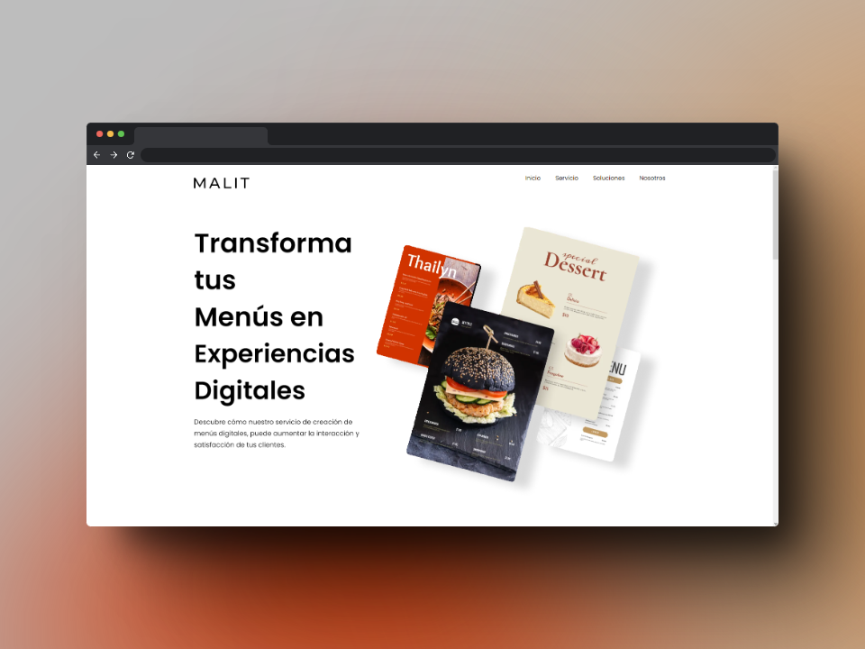
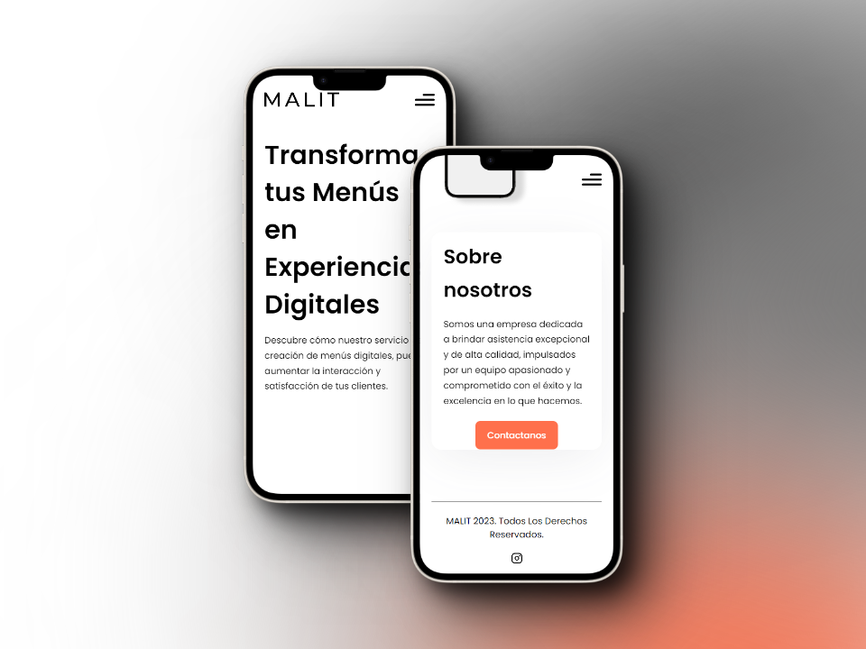

<!-- Please update value in the {}  -->

<h1 align="center">Malit - Restaurant Management Tool</h1>

<div align="center">
  <h3>
    <p>You can visit malit here</p>
    <a href="https://www.malit.com.mx">
      Malit
    </a>
  </h3>
</div>

<!-- TABLE OF CONTENTS -->

## Table of Contents

- [Overview](#overview)
- [Technologies Used](#technologies-used)
- [Features](#features)
- [How to use](#how-to-use)
- [Future Plans](#future-plans)
- [Contact](#contact-us)

<!-- OVERVIEW -->

## Overview




### Technologies Used

<!-- This section should list any major frameworks that you built your project using. Here are a few examples.-->

- [React](https://reactjs.org/)
- [TailwindCSS](https://tailwindcss.com)
- [Node.js](https://nodejs.org/es)
- [Firebase](https://firebase.google.com/?gad=1&gclid=Cj0KCQjw0vWnBhC6ARIsAJpJM6fQIVSMJiUc-6crn_Bp_hZQTjZpOaqjbPLYqpzbKi7mWU4jMWmV_rsaAunkEALw_wcB&gclsrc=aw.ds&hl=es-419)

## Features

<!-- List the features of your application or follow the template. Don't share the figma file here :) -->

Malit is a restaurant management tool created by a group of friends who are passionate about programming. The goal of this project is to test our knowledge in both frontend and backend development, while creating a useful tool for restaurant owners and managers.

The tool is designed to help restaurants with their day-to-day operations, such as managing orders, tracking inventory, and analyzing sales data. Malit is also designed to be easy to use, with a user-friendly interface that makes it simple for restaurant staff to learn and navigate.

Malit is still in development, and we are constantly working on new features and improvements. Our team is committed to providing the best possible experience for restaurant owners and managers, and we welcome feedback and suggestions from our users.

## How To Use

<!-- Example: -->

To use Malit, simply sign up for an account and log in. From there, you can start adding your restaurant's information, such as menu items, inventory, and sales data. You can also track orders and manage your staff using the tool.

To clone and run this application, you'll need [Git](https://git-scm.com) and [Node.js](https://nodejs.org/en/download/) (which comes with [npm](http://npmjs.com)) installed on your computer. From your command line:

```bash
# Clone this repository
$ git clone https://github.com/JHUMBERTTO/Malit.git

# Install dependencies
$ npm install

# Run the app
$ npm run dev
```
Open [http://localhost:3000](http://localhost:3000) with your browser to see the result.


## Future Plans

We plan to continue developing Malit and adding new features to make it even more useful for restaurant owners and managers. Some of the features we are working on include:
Integration with popular payment gateways Customizable reports and analytics Mobile app version for both iOS and Android

## Contact Us

If you have any questions, feedback, or suggestions, please feel free to send an email to malitcontacto@gmail.com We would love to hear from you and help you with any issues you may be experiencing. Thank you for using Malit!